# Workflow Diagrams

## High-Level Architecture

```mermaid
graph TB
    User[User/API] -->|Upload Input| S3[S3 Bucket<br/>inputs/]
    User -->|Start Execution| SF[Step Functions<br/>State Machine]
    SF -->|Read Input| S3
    
    SF -->|Invoke| Lambda1[Validation API<br/>Lambda]
    SF -->|Invoke| Lambda2[Deployment API<br/>Lambda]
    SF -->|Invoke| Lambda3[Notification API<br/>Lambda]
    
    Lambda1 -.->|Check Token| SM[Secrets Manager<br/>API Tokens]
    Lambda2 -.->|Check Token| SM
    Lambda3 -.->|Check Token| SM
    
    SF -->|Store Token| DDB[(DynamoDB<br/>Task Tokens)]
    SF -->|Wait...| Wait[⏸️ Paused<br/>Waiting for Callback]
    
    Jira[Jira Automation<br/>Story = Done] -->|Webhook| APIGW[API Gateway]
    APIGW -->|Invoke| LambdaCB[Callback Lambda]
    LambdaCB -->|Get Token| DDB
    LambdaCB -->|SendTaskSuccess| SF
    
    SF -->|Resume| Process[Process Result]
    Process -->|Write Results| S3Out[S3 Bucket<br/>outputs/]
    Process -->|Write Logs| S3Log[S3 Bucket<br/>logs/]
    
    SF -->|Logs| CW[CloudWatch Logs]
    Lambda1 -->|Logs| CW
    Lambda2 -->|Logs| CW
    Lambda3 -->|Logs| CW
    LambdaCB -->|Logs| CW
    
    style Wait fill:#ffeb3b
    style SF fill:#4caf50
    style DDB fill:#2196f3
    style Jira fill:#ff9800
```

## Step Functions State Machine Flow

## Callback Sequence

```mermaid
sequenceDiagram
    participant SF as Step Functions
    participant DDB as DynamoDB
    participant Jira as Jira Automation
    participant APIGW as API Gateway
    participant Lambda as Callback Lambda
    
    Note over SF: Workflow executing...
    SF->>DDB: Store task token<br/>Key: jiraStoryId<br/>Value: taskToken
    Note over SF: 🔒 PAUSED<br/>Waiting for callback
    
    Note over Jira: Story status → Done
    Jira->>APIGW: POST /callback<br/>{jiraStoryId, message, status}
    APIGW->>Lambda: Invoke with payload
    
    Lambda->>DDB: Get task token<br/>for jiraStoryId
    DDB-->>Lambda: Return taskToken
    
    alt Success Status
        Lambda->>SF: SendTaskSuccess<br/>(taskToken, output)
    else Failure Status
        Lambda->>SF: SendTaskFailure<br/>(taskToken, error)
    end
    
    Lambda->>DDB: Delete task token<br/>(cleanup)
    Lambda-->>APIGW: 200 OK
    APIGW-->>Jira: Success response
    
    Note over SF: 🔓 RESUMED<br/>Continue execution
    SF->>SF: Process callback result
    SF->>SF: Write results to S3
```

## IAM Roles and Permissions Flow

## Data Flow Through S3

---

## How to Use These Diagrams

These Mermaid diagrams will render automatically in:
- GitHub README files
- GitLab
- Many Markdown editors
- Mermaid Live Editor: https://mermaid.live

Copy any diagram into the Mermaid Live Editor to customize or export as PNG/SVG.
